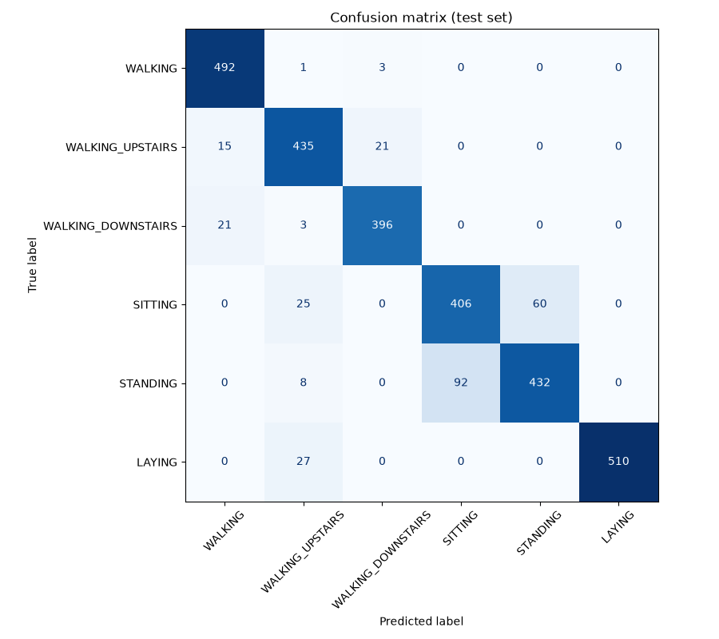

# 02 – IoT & Intelligence artificielle 

Mini-expérimentation de reconnaissance de mouvements.

## Installation

Prérequis : Python 3.11. (TensorFlow 2.21 ne fonctionne qu'avec Python 3.10 à 3.13, pas avec 3.14)

```bash
# créer et activer l'environnement virtuel
python3.11 -m venv .venv
source .venv/bin/activate        # Windows : .venv\Scripts\activate

# installer les dépendances
pip install -r requirements.txt

# télécharger le dataset (~60 Mo, extrait dans data/)
python scripts/download_data.py
```

## Dataset

J'utilise le dataset **UCI HAR** (Human Activity Recognition Using Smartphones).

- 30 personnes avec un smartphone à la ceinture (Samsung Galaxy S II)
- accéléromètre + gyroscope 3 axes, échantillonnés à 50 Hz
- 6 activités : `WALKING`, `WALKING_UPSTAIRS`, `WALKING_DOWNSTAIRS`, `SITTING`, `STANDING`, `LAYING`
- les signaux sont déjà découpés en fenêtres de 2,56 s (128 mesures) avec 50 % de chevauchement
- séparation train / test déjà faite **par personne** (21 personnes en train, 9 en test) : 7352 fenêtres de train, 2947 de test

C'est un dataset très utilisé, il a plus de 3 classes et il est déjà propre.
Le dataset n'est pas versionné dans le repo, il faut le télécharger avec le script ci-dessus.

## Préparation des données

Le code est dans `src/data.py` (on peut le lancer avec `python src/data.py` pour afficher les dimensions et la répartition des classes).

- **Signaux utilisés** : j'utilise directement les signaux bruts (`Inertial Signals`) et pas les 561 features déjà calculées du dataset, parce qu'un ESP32 n'aurait pas ces features, il aurait juste les valeurs du capteur. Je garde 6 canaux : `total_acc` x/y/z (accéléromètre avec la gravité) et `body_gyro` x/y/z (gyroscope). Je n'ai pas pris `body_acc` car c'est l'accélération sans la gravité, obtenue avec un filtre, donc ce n'est pas ce qu'un capteur donne directement.
- **Fenêtres** : déjà découpées dans le dataset, chaque exemple a la forme `(128, 6)`.
- **Nettoyage** : je retire les fenêtres qui contiennent des valeurs manquantes (en pratique il n'y en a pas, le dataset est propre).
- **Normalisation** : pour chaque canal, je soustrais la moyenne et je divise par l'écart-type. Ces valeurs sont calculées **uniquement sur le train** puis appliquées au test, pour ne pas utiliser d'informations du test pendant l'entraînement.
- **Labels** : passés de 1-6 à 0-5.

Répartition des classes dans le train : entre 986 (`WALKING_DOWNSTAIRS`) et 1407 (`LAYING`) fenêtres, donc à peu près équilibré.

## Modèle

Le code est dans `src/train.py` :

```bash
python src/train.py
```

Le modèle est sauvegardé dans `models/har_cnn.keras`, et la moyenne et l'écart-type de normalisation dans `models/norm_stats.json` (on en aura besoin pour normaliser les nouvelles données de la même façon).

### Architecture

Un petit réseau convolutif 1D (CNN), parce que les convolutions 1D marchent bien sur des séries temporelles et que ça reste léger :

| Couche | Sortie | Paramètres |
|---|---|---|
| Entrée | (128, 6) | 0 |
| Conv1D 16 filtres, noyau 5, ReLU | (124, 16) | 496 |
| MaxPooling1D (2) | (62, 16) | 0 |
| Conv1D 32 filtres, noyau 5, ReLU | (58, 32) | 2 592 |
| MaxPooling1D (2) | (29, 32) | 0 |
| Conv1D 32 filtres, noyau 3, ReLU | (27, 32) | 3 104 |
| GlobalAveragePooling1D | (32) | 0 |
| Dropout 0.3 | (32) | 0 |
| Dense 6, softmax | (6) | 198 |

**Total : 6 390 paramètres** (environ 25 Ko en float32).

J'ai utilisé un `GlobalAveragePooling1D` à la place d'un `Flatten` + grosse couche Dense, ça évite d'avoir des milliers de poids en plus à la fin du réseau.

### Entraînement

- optimiseur Adam, loss `sparse_categorical_crossentropy`
- batch de 32, 30 epochs maximum
- 20 % du train gardé pour la validation (`validation_split`)
- early stopping sur la loss de validation (patience 5), on garde les meilleurs poids
- seed fixée à 42 pour pouvoir reproduire les résultats

## Évaluation

Le code est dans `src/evaluate.py` (à lancer après l'entraînement) :

```bash
python src/evaluate.py
```

Le modèle est évalué sur le jeu de test (les 9 personnes qui n'ont pas servi à l'entraînement). Les résultats sont enregistrés dans `results/metrics.txt` et `results/confusion_matrix.png`.

### Résultats

- **Accuracy : 90,6 %**
- **F1-score macro : 0,907** (moyenne du F1 de chaque classe, sans tenir compte du nombre d'exemples par classe)

| Activité | Précision | Rappel | F1-score |
|---|---|---|---|
| WALKING | 0.932 | 0.992 | 0.961 |
| WALKING_UPSTAIRS | 0.872 | 0.924 | 0.897 |
| WALKING_DOWNSTAIRS | 0.943 | 0.943 | 0.943 |
| SITTING | 0.815 | 0.827 | 0.821 |
| STANDING | 0.878 | 0.812 | 0.844 |
| LAYING | 1.000 | 0.950 | 0.974 |



### Analyse

**Ce qui est bien reconnu :**
- `WALKING` (99 % de rappel) et `LAYING` (100 % de précision) sont les mieux reconnus. Pour `LAYING` c'est logique : le téléphone est à l'horizontale, donc la gravité est sur un autre axe que pour toutes les autres activités.
- Les activités « en mouvement » (marcher, monter, descendre) ne sont presque jamais confondues avec les activités « statiques » (assis, debout, allongé). Le modèle sépare bien les deux groupes.

**Ce qui est confondu :**
- **`SITTING` / `STANDING`** : c'est la plus grosse erreur (92 `STANDING` prédits `SITTING` et 60 dans l'autre sens). C'est normal : dans les deux cas la personne ne bouge pas et le téléphone est à la ceinture à peu près dans la même orientation, donc les signaux se ressemblent beaucoup. Il n'y a que de petites différences d'inclinaison.
- **Marcher / monter / descendre** : quelques confusions entre les trois (par exemple 21 `WALKING_DOWNSTAIRS` prédits `WALKING`), car ce sont des mouvements proches, surtout sur des fenêtres courtes de 2,56 s.
- **Une erreur bizarre** : 27 `LAYING` et 25 `SITTING` prédits `WALKING_UPSTAIRS`. Je ne m'attendais pas à ça. Mon hypothèse est que ça vient de certaines personnes du test qui portaient le téléphone un peu différemment (orientation).

## Sources

- UCI HAR Dataset : https://archive.ics.uci.edu/dataset/240/human+activity+recognition+using+smartphones
